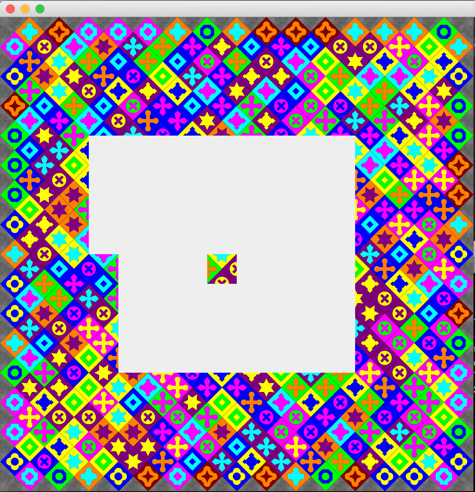

# Eternity II Solver
This is my second go at writing backtracking solver for Eternity II (my first, in poorly written Java, project can be found [here](https://github.com/AntonFagerberg/Eternity-II-Puzzle-Solver)). This one is written in Scala and should be much more optimized. The iteration approach is also different in this project.

In this project, the application attempts to solve the puzzle by starting from cell `A1` and spiral in towards the given middle piece `I8`. By doing so, all the corner and border pieces are consumed directly, no idea if this actually makes any difference.

When the application is started, it will spawn a `worker` actor for each available core in your machine and each `worker` will try to solve the puzzle on its own - the actors are all working independently of each other. The main application will also spawn an actor which will receive all the records and write the current best one to file (`output.txt`) and render it in a GUI (the graphics was taken from the [E2_Manual project](http://sourceforge.net/projects/e2manual/?source=navbar)).

Each worker will shuffle the pieces before attempting to solve the puzzle so each restart of the application will yield a different results. (The random seeds are written to the console when starting the application).

## Run
Get [SBT](http://www.scala-sbt.org/index.html) and use the following command in the project root to to build & run it:

`sbt run`

## Output example (output.txt)
The rotation is number of turns clockwise.
```
Length: 21 (2015-10-27 13:30:20.220})
Cell	Piece	Rotation	Data
A  1	4		3		    XQIX
A  2	32		2			XQTQ
A  3	41		2			XESQ
A  4	14		2			XAUE
A  5	15		2			XIJA
A  6	31		2			XQOI
A  7	16		2			XIRQ
A  8	43		2			XEOI
A  9	47		2			XEHE
A 10	53		2			XMGE
A 11	13		2			XAHM
A 12	24		2			XITA
A 13	26		2			XQBI
A 14	27		2			XQBQ
A 15	29		2			XQRQ
A 16	3       2			XXIQ
B 16	40		1			IXES
C 16	21		1			EXID
D 16	33		1			IXQH
E 16	28		1			QXQJ
I  8	139	    2			RFFK
```

## GUI

